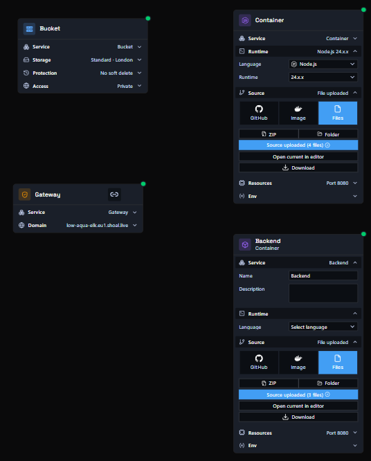
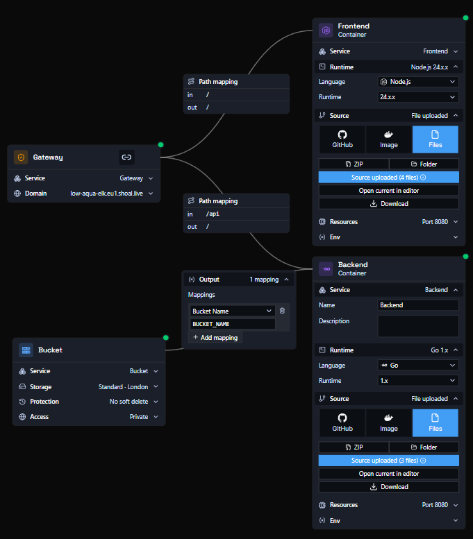
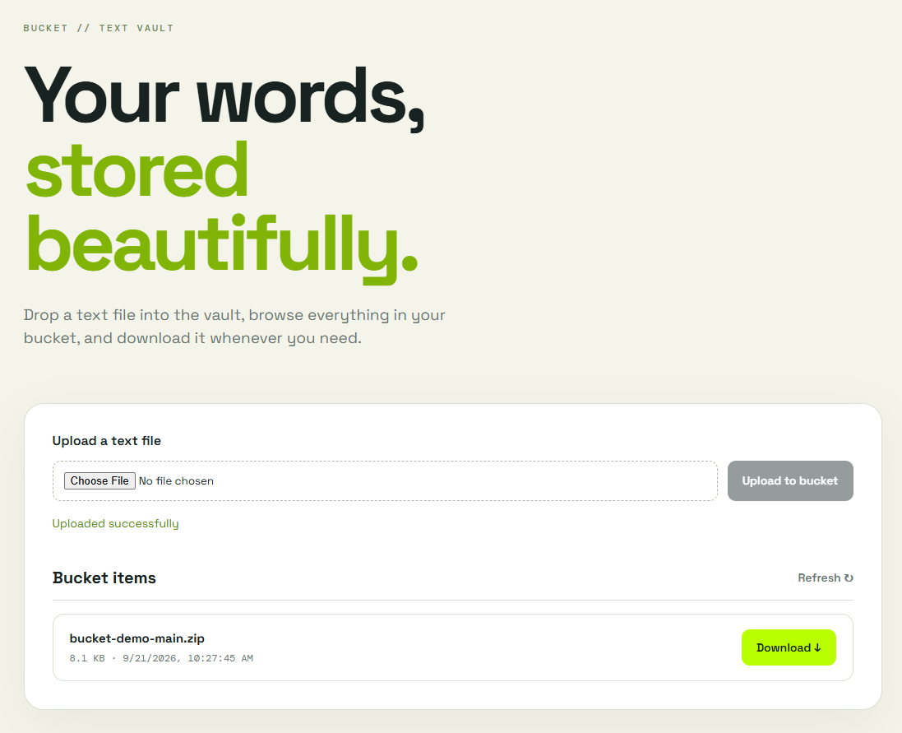

# Deploying an Application with a Bucket

In this example, we have an application that uploads, lists, and downloads text files stored in a Cloud Storage bucket. Shoal creates the bucket for you and hands its name to your backend - there are no Google Cloud credentials to connect and no key files to manage.

You need four components: two **container nodes**, a **gateway node**, and a **bucket node**.

- **Bucket node** - creates the storage bucket and provides its name as an output you map into your container.
- **Container nodes** - one frontend and one backend, each linked to its own source code.
- **Gateway node** - the single domain your users hit, routing each path to the right container.

Hit deploy, and it just works.

!!! tip "Skip the setup - use the blueprint"
    This whole graph is published as a ready-made blueprint: [Text Vault - Bucket Demo](https://app.shoalstack.com/blueprints/ab0c9e36-118a-4ede-9c55-5cc18cc5c74e). Open it, set your gateway domain, and press **Deploy** - every node, path, and output mapping described below is already wired up.

    Prefer to build it yourself, or want to understand what the blueprint does? Follow the steps on this page.

!!! info "Example source code"
    The two services used on this page are in the [bucket-demo repository](https://github.com/shoal-platform/bucket-demo). Clone it, upload each folder as its own container source, and follow the steps below.

---

## Example - a text vault

Users drop a text file onto a page, see everything stored in the bucket, and download any file back. The browser never talks to the bucket directly - every request goes through the backend.

| Service | Responsibility | Talks to |
|---|---|---|
| `frontend` | Next.js page with the upload form and the file list | Nothing - the browser calls the backend through the gateway |
| `backend` | Go API that reads and writes objects in the bucket | Bucket |

The backend exposes four endpoints:

| Method | Path | Description |
|---|---|---|
| `GET` | `/health` | Returns `{"status":"ok"}` |
| `GET` | `/items` | Lists every object in the bucket |
| `POST` | `/upload` | Multipart form upload, field name `file`, max 10 MB |
| `GET` | `/download?name=<file>` | Downloads the named object as an attachment |

---

## Step One - Place the nodes

Drag a **bucket node**, a **gateway node**, and two **container nodes** onto the canvas.

### The bucket

Click the bucket node to open it and review its settings:

| Setting | What it does | Value used here |
|---|---|---|
| **Storage** | The storage class and the region the bucket lives in | `Standard - London` |
| **Protection** | Whether deleted objects can be recovered for a period after deletion | `No soft delete` |
| **Access** | Whether objects can be read publicly or only by your services | `Private` |

Keep **Access** set to `Private` for this example. The backend reads and writes the bucket on behalf of the browser, so nothing needs to be public.

### The frontend

Rename the first container node to `Frontend`. Expand **Runtime** and set **Language** to `Node.js`, then expand **Source** and upload the `frontend` folder from the demo repository (or point it at your GitHub repo). Set **Port** to `8080` under **Resources**.

### The backend

Rename the second container node to `Backend`. Expand **Runtime** and set **Language** to `Go`, then expand **Source** and upload the `backend` folder. Set **Port** to `8080`.

The backend needs a single environment variable - the bucket name - which you map from the bucket node in Step Two rather than typing in by hand.

| Service | Environment variable | Value comes from |
|---|---|---|
| `backend` | `BUCKET_NAME` | Bucket - Bucket Name |

!!! note "No credentials needed"
    The demo's README mentions `GOOGLE_APPLICATION_CREDENTIALS` for running locally. On Shoal you can leave it unset - the backend authenticates to the bucket automatically when deployed.

### The gateway

Click the gateway node, expand the **Domain** section, and enter the URL name you want. For example, entering `text-vault` will make your app available at `text-vault.eu1.shoal.live`. You can also point a [custom domain](faq-custom-domain.md) at this address.

---

## Step Two - Create the edges

### Connect the gateway to the containers with paths

Link both containers to the gateway node, then double-click each connection to set its path mapping.

| Connection | IN | OUT | Result |
|---|---|---|---|
| Gateway -> Frontend | `/` | `/` | Catch-all: serves the frontend |
| Gateway -> Backend | `/api` | `/` | Browser calls to `/api/items`, `/api/upload` and `/api/download` reach the backend's `/items`, `/upload` and `/download` |

**IN** is the path your users hit on the gateway; **OUT** is the path the container actually listens on. More specific paths always win over `/`, so `/api` takes priority over the frontend's catch-all. See [path-based routing](path-routing.md) for more detail.

!!! tip "No rewrite config needed"
    The frontend calls the backend through relative `/api/*` paths. Running locally, the demo's README suggests a Next.js rewrite to forward them. On Shoal the gateway does that forwarding for you, so the frontend needs no `next.config.js`.

### Connect the bucket to the backend

Link the bucket node to the `Backend` container. The connection carries an **Output** panel where you map bucket values onto environment variables. Click **Add mapping** and add:

| Output | Environment variable |
|---|---|
| Bucket Name | `BUCKET_NAME` |

Only the backend touches the bucket. The frontend has no connection to it at all.

You can manage environment variables from each container node's **Env** section, or from the environment settings page. See the [environment variables guide](faq-env-vars.md) for more detail.

---

## Step Three - Deploy

Press **Deploy**. You can watch the deployment in real time via the **Observability** menu, or by clicking the link on the deploy button.

Once your graph is working, you can share it with others by pressing **Publish Blueprint** - which is exactly how the [blueprint linked at the top of this page](https://app.shoalstack.com/blueprints/ab0c9e36-118a-4ede-9c55-5cc18cc5c74e) was made.

## Done

Open your gateway address. Choose a file and press **Upload to bucket** - the page shows **Uploaded successfully** and the file appears under **Bucket items**. Click **Download** next to any item to fetch it back from the bucket.

!!! note "Things to know about the demo"
    - Files are stored under their original name. Uploading a file with an existing name overwrites it.
    - The backend allows requests from any origin (CORS `*`). Restrict this before using the code for anything beyond a demo.
