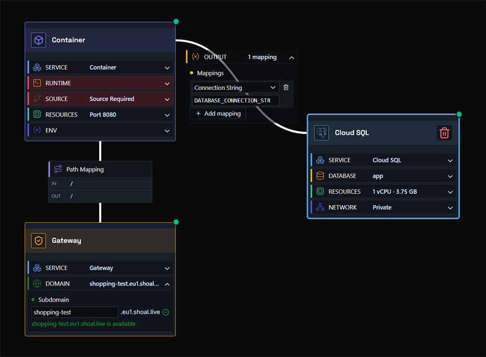
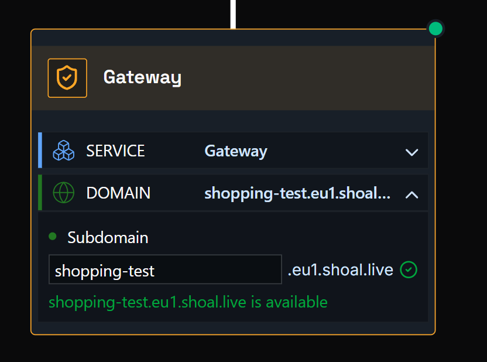
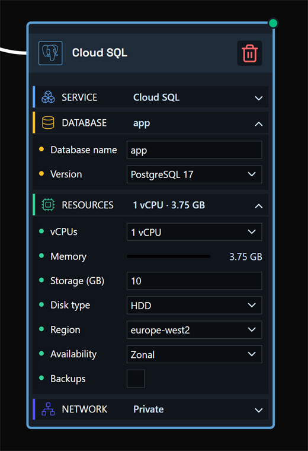
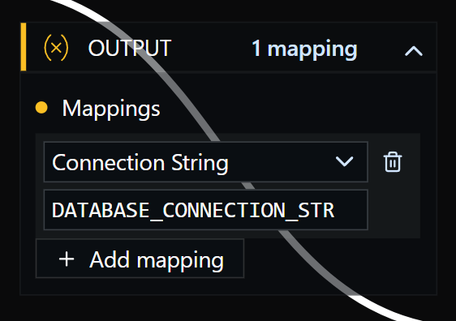

# Deploying an Application with Cloud SQL

In this example, we have an application connected to a managed Postgres database running on Google Cloud SQL. Shoal provisions and manages the instance for you - there are no Google Cloud credentials to connect and no console to visit.

Hit deploy, and it just works.

### Step One

Drag a container node, a gateway node, and a Cloud SQL node onto the canvas, then link them together.

- **Container node** - links to your source code, runs and scales your container, and holds app environment variables.
- **Gateway node** - where you set your app's web address.
- **Cloud SQL node** - sets up your managed Postgres database and provides the output values you map into your container.

### Step Two

Click the gateway node to open it, expand the **Domain** section, and enter the URL name you want. For example, entering `shopping-test` will make your app available at `shopping-test.eu1.shoal.live`. You can also point a [custom domain](faq-custom-domain.md) at this address.

### Step Three

Click the container node to open it, expand the **Source** section, and set up your source - either a GitHub repo or a file upload. If your project includes a Dockerfile, Shoal builds from it; otherwise Shoal auto-detects your stack and builds it for you.

### Step Four

Click the Cloud SQL node to open it and fill in its settings:

| Setting | What it does |
|---|---|
| **Database name** | The name of the database created on the instance |
| **Postgres version** | The version of Postgres the instance runs |
| **Instance size** | How much compute the database gets |
| **Storage size** | How much disk space the database gets |

### Step Five

Map the Cloud SQL outputs to your container environment variables. The node exposes:

| Output | Typical use |
|---|---|
| `connection_string` | The full Postgres URL - usually mapped to `DATABASE_URL` |
| `host` | Database host, if your app expects separate values |
| `port` | Database port |
| `username` | Database user |
| `password` | Database password |
| `database` | Database name |

You can manage environment variables from the container node's **Env** section, or from the environment settings page. See the [environment variables guide](faq-env-vars.md) for more detail.

### Step Six

Press **Deploy**. You can watch the deployment in real time via the **Observability** menu, or by clicking the link on the deploy button.

### Done

Your app is live at the address you configured - connected to a managed Cloud SQL Postgres database and running in a scalable, resilient, and protected environment.
