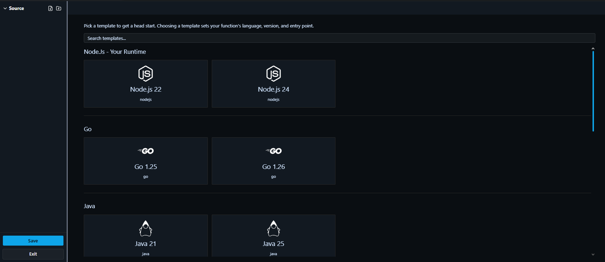
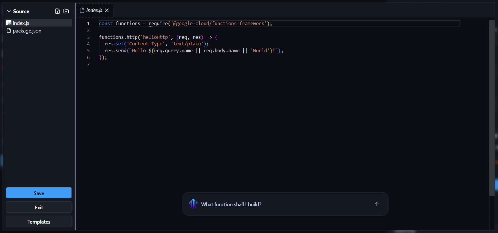

# Deploying an Application with Function Node

Deploy a serverless function in a few simple steps. In this example, we have a Node.js function we want to expose on the internet, with source code hosted on GitHub.

You need two components: a **function node** and a **gateway node**.

- **Function node** - links to your source code. Shoal builds and runs your function, scales it automatically, and keeps it resilient.
- **Gateway node** - where you set the DNS name (web address) you want your function to be reachable at.

---

Follow the steps below to deploy your function.

1. Drag a function node and a gateway node onto the canvas, then link them together.

    

2. Click the function node to open it, then use the **Runtime** and **Source** sections to configure it. In **Runtime**, set the **Language**, **Version**, and **Entry Point**; in **Source**, choose GitHub (then select your account, repository, and branch) or upload a file source.

    

    !!! info "Reminder"
        Make sure the **Entry Point** matches the exact name of the exported function in your code. If this is wrong, your function will fail to start.

    If you set **Source** to **Files** and select **New from Editor**, you can pick a starter template based on your language and runtime instead of writing from scratch.

    

    Once you select a template, the editor opens with a working example you can build on. An AI assistant is also available to help you write your function.

    

3. Click the gateway node to open it, expand the **Domain** section, and enter the URL name you want. For example, entering `my-function` will make your function available at `my-function.eu1.shoal.live`.

4. Press **Deploy**. You can watch the deployment in real time via the **Deployments** page, or check build and runtime logs under **Observability & Logs**.

### Done

Your function is live at the address you configured - running in a scalable, resilient, and protected environment.
