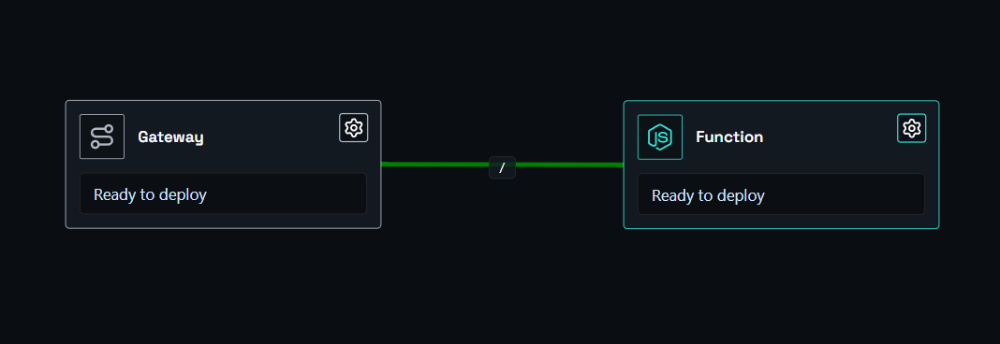
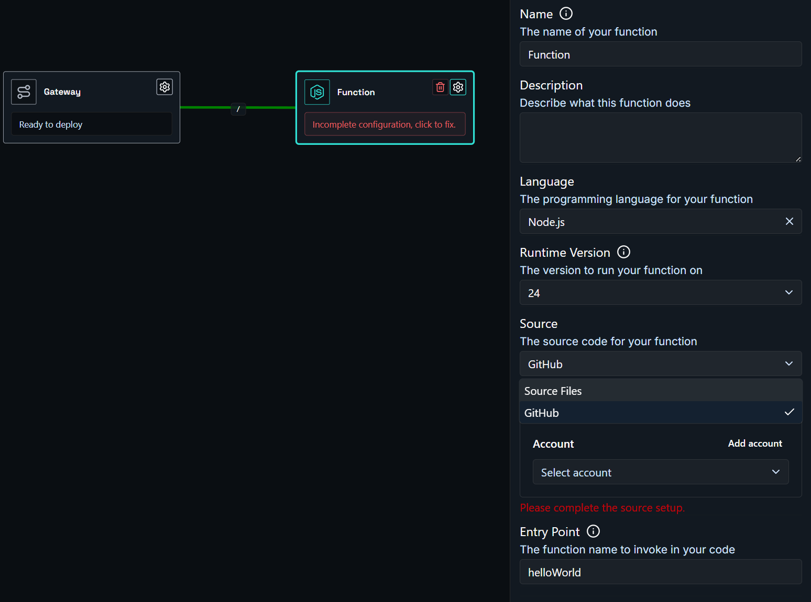

# Deploying an Application with Function Node

Deploy a serverless function in a few simple steps. In this example, we have a Node.js function we want to expose on the internet, with source code hosted on GitHub.

You need two components: a **function node** and a **gateway node**.

- **Function node** - links to your source code. Shoal builds and runs your function, scales it automatically, and keeps it resilient.
- **Gateway node** - where you set the DNS name (web address) you want your function to be reachable at.

Hit deploy, and it just works.

---

### Step One

Drag a function node and a gateway node onto the canvas, then link them together.

### Step Two

Click the function node, open the **Config** tab, and configure your function. Set the **Language**, **Runtime Version**, and **Source**. If using GitHub, select your account, repository, and branch or you can just upload a file source.

!!! info "Reminder"
    Make sure the **Entry Point** matches the exact name of the exported function in your code. If this is wrong, your function will fail to start.

### Step Three

Click the gateway node, open the **Config** tab, and enter the URL name you want. For example, entering `my-function` will make your function available at `my-function.eu1.shoal.live`. You can also point a [custom domain](faq-custom-domain.md) at this address.

### Step Four

Press **Deploy**. You can watch the deployment in real time via the **Observability** menu.

### Done

Your function is live at the address you configured - running in a scalable, resilient, and protected environment.
