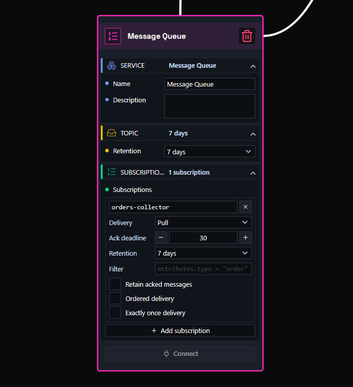
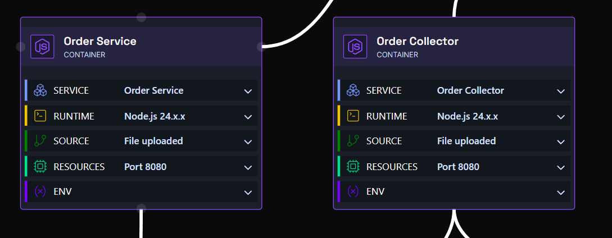
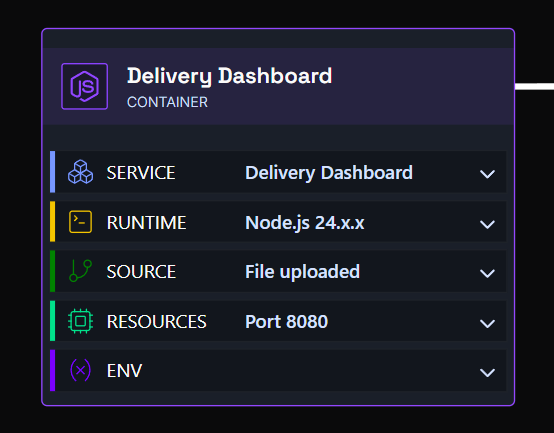
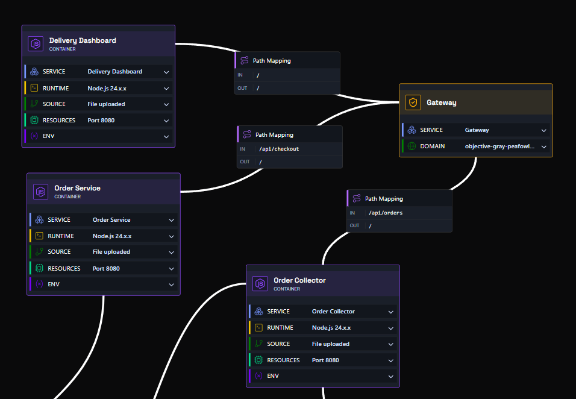
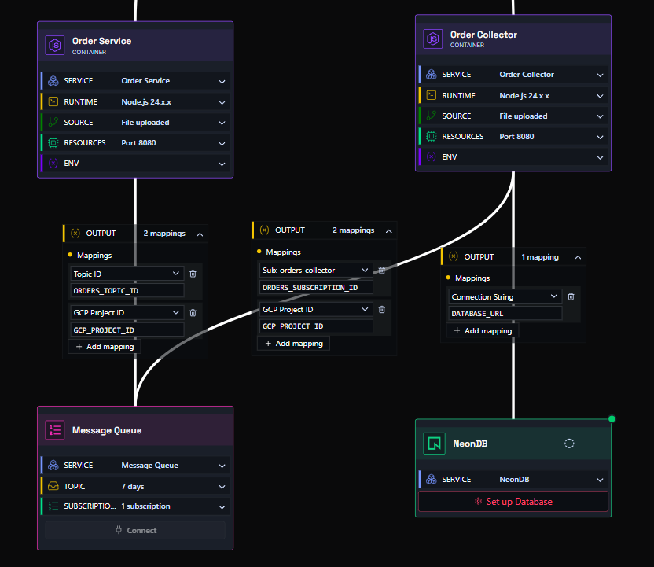

# Deploying an Application with a Message Queue

In this example, we have an application that accepts orders over HTTP, queues them, and writes them to a database from a separate worker. The queue sits between the two, so the checkout request returns in milliseconds and orders keep flowing even while the database is slow or unavailable.

You need six components: three **container nodes**, a **gateway node**, a **message queue node**, and a **Neon node**.

- **Message queue node** - creates the topic your producer publishes to, and the subscriptions your consumers read from.
- **Container nodes** - one producer, one consumer, and one frontend, each linked to its own source code.
- **Gateway node** - the single domain your users hit, routing each path to the right container.
- **Neon node** - the serverless Postgres database the consumer writes into.

Hit deploy, and it just works.

!!! tip "Skip the setup - use the blueprint"
    This whole graph is published as a ready-made blueprint: [Order Queue - Producer, Consumer & Dashboard](https://app.shoalstack.com/blueprints/bc3a1979-0b6e-4487-a43b-2173590218e0). Open it, set your gateway domain and database, and press **Deploy** - every node, path, and output mapping described below is already wired up.

    Prefer to build it yourself, or want to understand what the blueprint does? Follow the steps on this page.

!!! info "Example source code"
    The three services used on this page are in the [message-queue-demo repository](https://github.com/shoal-platform/message-queue-demo). Clone it, upload each folder as its own container source, and follow the steps below.

---

## Example - a delivery app

Customers place orders on a dashboard. Rather than writing straight to the database, the order service publishes each accepted order to a topic and replies immediately. A collector subscribes to that topic and does the database work in its own time.

| Service | Responsibility | Talks to |
|---|---|---|
| `order-service` | Validates an order and publishes it to the topic | Message queue (topic) |
| `order-collector` | Subscribes to the queue and inserts orders into Postgres | Message queue (subscription), Neon |
| `delivery-dashboard` | Serves the frontend that places orders and lists them in real time | Nothing - the browser calls the other two through the gateway |

!!! info "Why put a queue in the middle?"
    The producer never waits for the database. If the collector is redeploying, scaled to zero, or the database is under load, messages simply wait in the queue and are delivered when the consumer is ready. Nothing is lost, and checkout stays fast.

---

## Step One - Configure the message queue node

Drag a **message queue node** onto the canvas and open it.

The node has two parts:

**Topic** - where producers publish. Set **Retention** to how long an unacknowledged message should be kept - `7 days` is a sensible default and is the maximum on most setups.

**Subscriptions** - where consumers read. Click **Add subscription** and give it a name; in this example it is `orders-collector`. Each consumer should have its own subscription, because every subscription gets its own copy of every message.

| Setting | What it does | Value used here |
|---|---|---|
| Delivery | `Pull` lets the consumer fetch messages itself. `Push` posts them to an HTTP endpoint instead. | `Pull` |
| Ack deadline | Seconds the consumer has to acknowledge a message before it is redelivered. Raise it if your processing is slow. | `30` |
| Retention | How long undelivered messages are kept in the subscription. | `7 days` |
| Filter | Optional expression so this subscription only receives matching messages, for example `attributes.type = "order"`. | *(empty)* |
| Retain acked messages | Keeps messages after acknowledgement so you can replay them. | Off |
| Ordered delivery | Delivers messages with the same ordering key in order. Costs throughput. | Off |
| Exactly once delivery | Guarantees a message is not delivered again after a successful acknowledgement. | Off |

!!! tip "Design for redelivery"
    Unless you enable **Exactly once delivery**, a message can be delivered more than once - for example if a consumer crashes before acknowledging. Make your writes idempotent. The example collector inserts with `ON CONFLICT (id) DO NOTHING`, so a redelivered order is stored exactly once.

---

## Step Two - Configure the nodes

### The producer and the consumer

Drag two container nodes onto the canvas for `order-service` and `order-collector`. Open each one, expand **Source**, and point it at your GitHub repo or upload the service folder. Set **Port** to `8080` for both.

Neither service needs its topic or subscription id typed in by hand - you map those from the queue node in Step Three.

| Service | Environment variable | Value comes from |
|---|---|---|
| `order-service` | `ORDERS_TOPIC_ID` | Message queue - Topic ID |
| `order-service` | `GCP_PROJECT_ID` | Message queue - GCP Project ID |
| `order-collector` | `ORDERS_SUBSCRIPTION_ID` | Message queue - Sub: `orders-collector` |
| `order-collector` | `GCP_PROJECT_ID` | Message queue - GCP Project ID |
| `order-collector` | `DATABASE_URL` | Neon - Connection String |

### The frontend dashboard

Drag a third container node for `delivery-dashboard` and configure its source the same way. It serves static files only - no environment variables, no queue access.

The page posts new orders to `/api/checkout` and polls `/api/orders` every ten seconds, so orders appear in the list moments after the collector has written them. Both of those paths are provided by the gateway in Step Three, which is why the dashboard needs no knowledge of the other services.

### The database

Drag a **Neon node** onto the canvas, click **Set up Database**, and either select an existing project or choose **Create on deployment**. See the [Neon guide](deploy-app-neon.md) for the full walkthrough of that dialog.

The collector creates its own `orders` table on first start, so there is no migration step to run.

!!! note "Using Cloud SQL instead"
    Any Postgres works here. If you prefer a managed instance over serverless, drop a database node on the canvas instead and map its connection string to the same `DATABASE_URL` variable - the service code does not change. See [deploying with a database](deploy-app-database.md).

---

## Step Three - Configure the edges

### Connect the gateway to the containers with paths

Link all three containers to the gateway node, then double-click each connection to set its path mapping.

| Connection | IN | OUT | Result |
|---|---|---|---|
| Gateway -> Delivery Dashboard | `/` | `/` | Catch-all: serves the frontend |
| Gateway -> Order Service | `/api/checkout` | `/` | Browser checkout calls reach the producer's `POST /` |
| Gateway -> Order Collector | `/api/orders` | `/` | The dashboard's order list reads the consumer's `GET /` |

**IN** is the path your users hit on the gateway; **OUT** is the path the container actually listens on. More specific paths always win over `/`, so the two `/api/` routes take priority over the dashboard's catch-all. See [path-based routing](path-routing.md) for more detail.

Open the gateway node's **Domain** section and enter the URL name you want - for example `delivery-demo`, giving you `delivery-demo.eu1.shoal.live`.

### Connect the message queue to the producer and the consumer

Link the message queue node to both service containers. Each connection carries an **Output** panel where you map queue values onto environment variables.

On the **queue -> order-service** connection, add two mappings:

| Output | Environment variable |
|---|---|
| Topic ID | `ORDERS_TOPIC_ID` |
| GCP Project ID | `GCP_PROJECT_ID` |

On the **queue -> order-collector** connection, map the subscription rather than the topic:

| Output | Environment variable |
|---|---|
| Sub: `orders-collector` | `ORDERS_SUBSCRIPTION_ID` |
| GCP Project ID | `GCP_PROJECT_ID` |

If you added several subscriptions in Step One, the dropdown lists each one - pick the subscription belonging to the consumer on that connection.

### Connect the collector to the database

Link the Neon node to the `order-collector` container and map its output:

| Output | Environment variable |
|---|---|
| Connection String | `DATABASE_URL` |

Only the collector touches the database. The producer and the dashboard have no connection to Neon at all, which is the point of the queue.

You can manage environment variables from each container node's **Env** section, or from the environment settings page. See the [environment variables guide](faq-env-vars.md) for more detail.

---

## Step Four - Deploy

Press **Deploy**. You can watch the deployment in real time via the **Observability** menu, or by clicking the link on the deploy button.

Once your graph is working, you can share it with others by pressing **Publish Blueprint** - which is exactly how the [blueprint linked at the top of this page](https://app.shoalstack.com/blueprints/bc3a1979-0b6e-4487-a43b-2173590218e0) was made.

## Done

Open your gateway address and place an order. The dashboard confirms it immediately - that response comes from the producer as soon as the message is queued - and the order appears in the list a moment later, once the collector has consumed it from the subscription and written it to Neon.

To see the queue doing its job, pause or redeploy the collector and keep placing orders. Checkout carries on working, and every queued order lands in the database as soon as the collector is back.
