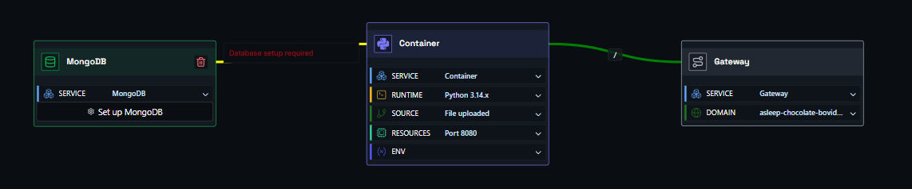
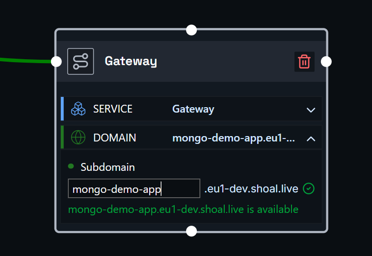
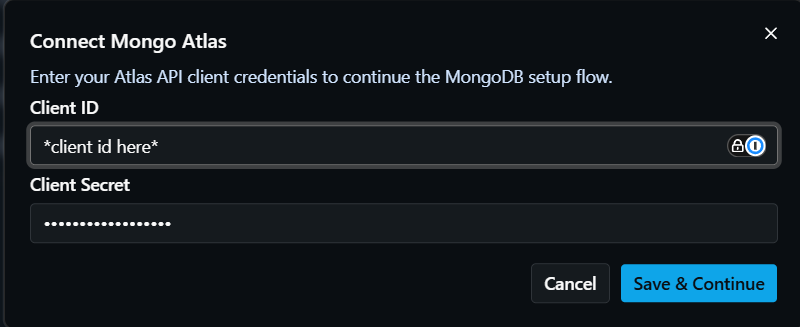
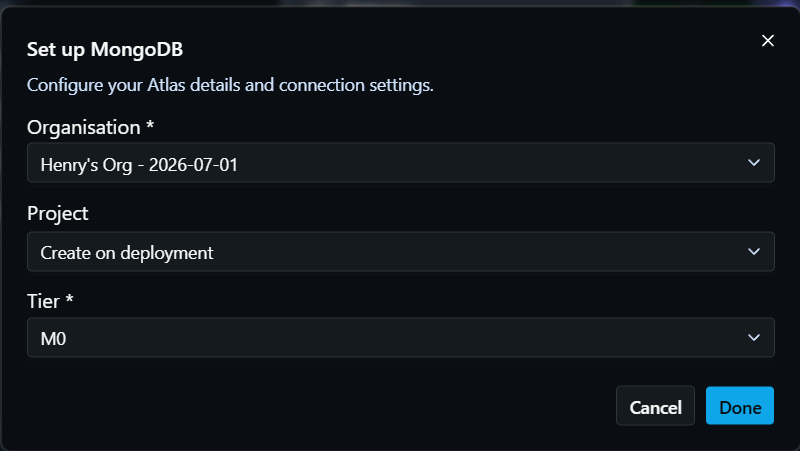
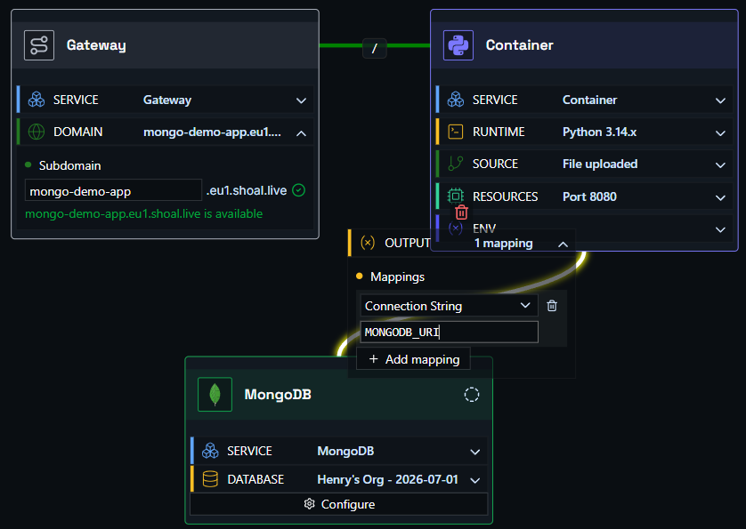

# Deploying an Application with MongoDB

In this example, we have an application connected to a MongoDB database hosted on MongoDB Atlas.

You need three components: a **container node**, a **gateway node**, and a **MongoDB node**.

- **Container node** - links to your source code, runs and scales your container, and holds app environment variables.
- **Gateway node** - where you set the DNS name for your app.
- **MongoDB node** - configures your MongoDB connection details and provides the output value you map into your container.

Hit deploy, and it just works.

### Step One

Drag a container node, a gateway node, and a MongoDB node onto the canvas, then link them together.

### Step Two

Click the gateway node to open it, expand the **Domain** section, and enter the URL name you want. For example, entering `shopping-test` will make your app available at `shopping-test.eu1.shoal.live`. You can also point a [custom domain](faq-custom-domain.md) at this address.

### Step Three

Click the container node to open it, expand the **Source** section, and set up your source - either a GitHub repo or a file upload. If your project includes a Dockerfile, Shoal builds from it; otherwise Shoal auto-detects your stack and builds it for you.

Open the MongoDB node and click **Set up MongoDB** (or **Configure** / **Edit** if it's already initialized).

If Atlas credentials are not saved for the space yet, Shoal prompts you with **Connect Mongo Atlas** first, where you enter your Atlas Client ID and Client Secret. If credentials are already saved, Shoal skips this step and opens setup directly.

In the setup dialog, choose your **Organisation**, then either select an existing **Project** and **Cluster** or choose **Create on deployment** where needed. If you're creating a new cluster, choose a **Tier** before clicking **Done**.

### Step Four

Map the MongoDB output `connection_string` to your container environment variable, usually `MONGODB_URI`. You can also map `username` and `password` if your app expects separate values.

You can manage environment variables from the container node config, or from the environment settings page. See the [environment variables guide](faq-env-vars.md) for more detail.

### Step Five

Press **Deploy**. You can watch the deployment in real time via the **Observability** menu, or by clicking the link on the deploy button.

### Done

Your app is live at the address you configured - connected to MongoDB and running in a scalable, resilient, and protected environment.
