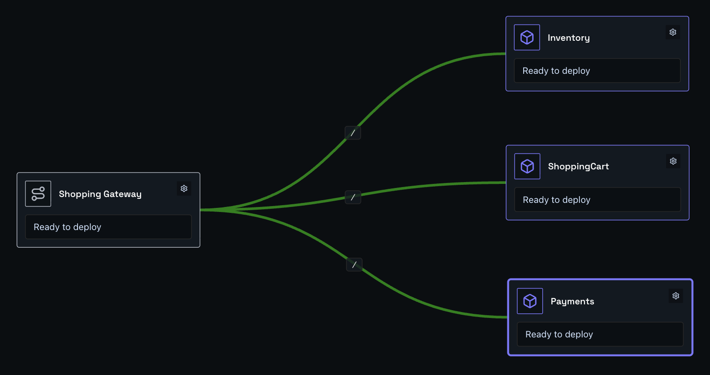
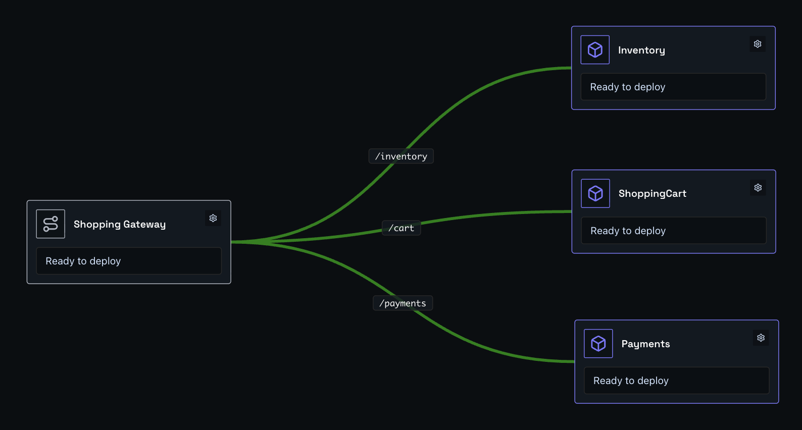

# Deploying an Application with Multiple Containers and Routing

In this example, we have an application made up of several independent services, all exposed under one domain. The gateway routes incoming requests to the right container based on the URL path.

You need four components: three **container nodes** and one **gateway node**.

- **Container nodes** - each links to its own source code and runs independently, with automatic scaling and resilience.
- **Gateway node** - directs incoming traffic to the right container based on the path you configure.

Hit deploy, and it just works.

---

## Example - a shopping app

In this example our app has three separate services, each responsible for a distinct part of the system:

| Service | Responsibility | Path |
|---|---|---|
| Inventory service | Lists products and provides item details | `/inventory/` |
| Cart service | Tracks what users are adding and buying | `/cart/` |
| Payments service | Handles checkout and links to payment providers | `/payments/` |

Each service listens on its own path, and the gateway uses those paths to route traffic to the correct container.

!!! info "How path routing works"
    The gateway matches the beginning of the URL path to decide where to send traffic. So a request to `shop.eu1.shoal.live/cart/add` is routed to the cart container, and `shop.eu1.shoal.live/inventory/search` goes to the inventory container.

    You can also use `/` as a catch-all route for a container - it will receive all traffic that doesn't match a more specific path. More specific paths always take priority, so `/cart/` will always win over `/`.

---

### Step One

Drag three container nodes and a gateway node onto the canvas. Link each container to the gateway, then configure each container node with its GitHub repo or file upload.

### Step Two

Set the path for each connection. Double-click a link between a container and the gateway to enter the path that should route to that container.

| Connection | Path to set |
|---|---|
| Gateway → Inventory | `/inventory/` |
| Gateway → Cart | `/cart/` |
| Gateway → Payments | `/payments/` |

### Step Three

Click the gateway node, open the **Config** tab, and enter the URL name you want. For example, entering `shopping-test` will make your app available at `shopping-test.eu1.shoal.live`. You can also point a custom domain at this address.

### Step Four

Press **Deploy**. You can watch the deployment in real time via the **Observability** menu, or by clicking the link on the deploy button.

### Done

Your app is live at the address you configured - with traffic routed to the right service, running in a scalable, resilient, and protected environment.
