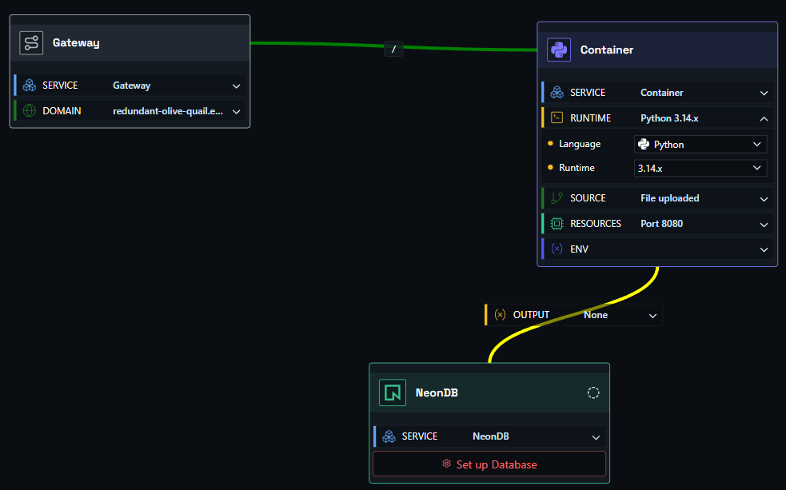
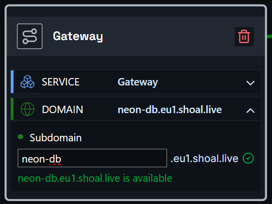
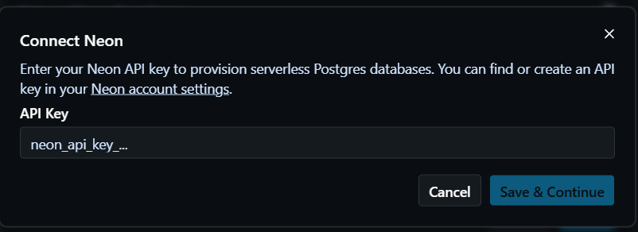
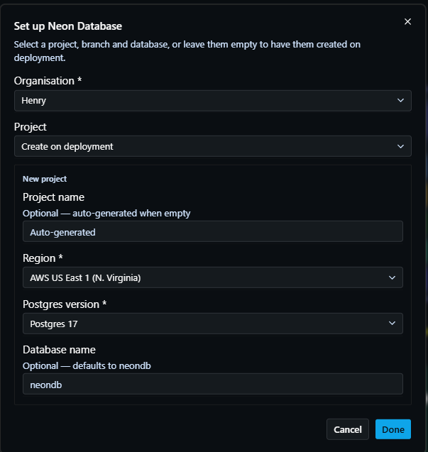
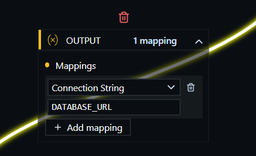

# Deploying an Application with Neon

In this example, we have an application connected to a serverless Postgres database provisioned on [Neon](https://neon.tech).

You need three components: a **container node**, a **gateway node**, and a **Neon node**.

- **Container node** - links to your source code, runs and scales your container, and holds app environment variables.
- **Gateway node** - where you set the DNS name for your app.
- **Neon node** - configures your Neon Postgres connection details and provides the output value you map into your container.

Hit deploy, and it just works.

### Step One

Drag a container node, a gateway node, and a Neon node onto the canvas, then link them together.

### Step Two

Click the gateway node to open it, expand the **Domain** section, and enter the URL name you want. For example, entering `shopping-test` will make your app available at `shopping-test.eu1.shoal.live`. You can also point a [custom domain](faq-custom-domain.md) at this address.

### Step Three

Click the container node to open it, expand the **Source** section, and set up your source - either a GitHub repo or a file upload. If your project includes a Dockerfile, Shoal builds from it; otherwise Shoal auto-detects your stack and builds it for you.

Open the Neon node and click **Set up Database** (or **Configure** / **Edit** if it's already initialized). If a Neon API key is not saved for the space yet, Shoal prompts you with **Connect Neon** first, where you enter your Neon API key. If a key is already saved, Shoal skips this step and opens setup directly.

In the **Set up Neon Database** dialog, choose your **Organisation**, then either select an existing **Project** or choose **Create on deployment**.

- If you select an existing project, choose a **Branch** (or create a new one), a **Database** (or leave it to be created on deployment), and a **Role** (defaults to the database owner).
- If you choose **Create on deployment**, Shoal creates the project for you - optionally set a project name, then pick a **Region**, a **Postgres version**, and an optional database name (defaults to `neondb`).

### Step Four

Map the Neon output `connection_string` to your container environment variable, usually `DATABASE_URL`. You can also map `host` and `port` if your app expects separate values.

You can manage environment variables from the container node's **Env** section, or from the environment settings page. See the [environment variables guide](faq-env-vars.md) for more detail.

### Step Five

Press **Deploy**. You can watch the deployment in real time via the **Observability** menu, or by clicking the link on the deploy button.

### Done

Your app is live at the address you configured - connected to Neon Postgres and running in a scalable, resilient, and protected environment.
