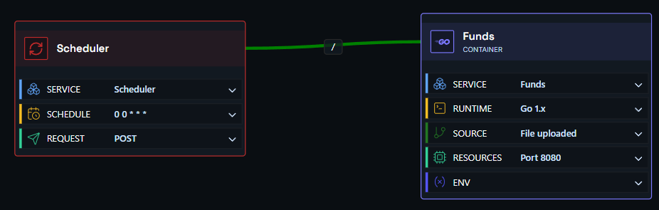
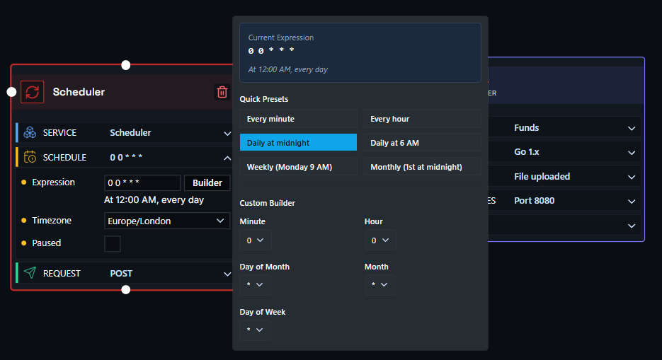

# Deploying an Application with a Scheduler

In this example, we have an application that runs on a schedule - for instance, posting a daily update to a Slack channel.

You need two components: a **container node** and a **scheduler node**.

- **Container node** - links to your source code and runs your container on demand.
- **Scheduler node** - where you set the times Shoal should trigger your container.

Hit deploy, and it just works.

### Step One

### Step Two

Click the scheduler node to open it, expand the **Schedule** section, and enter a crontab expression to set when your container should run. You can also set a **Timezone**, mark the schedule as **Paused**, and configure the **Request** (method, headers, and body) that Shoal sends when the job fires.

The scheduler uses standard crontab expressions. Here are some common examples:

| Expression | Runs... |
|---|---|
| `0 9 * * *` | Every day at 9:00am |
| `0 9 * * 1` | Every Monday at 9:00am |
| `*/15 * * * *` | Every 15 minutes |
| `0 8,17 * * *` | Every day at 8:00am and 5:00pm |
| `0 9 * * 1-5` | Weekdays (Mon-Fri) at 9:00am |

See the full [crontab expressions guide](faq-crontab.md) for more detail.

!!! tip "Not sure of your expression?"
    [crontab.guru](https://crontab.guru/){ target="_blank" } is a free interactive editor that translates crontab expressions into plain English as you type. Paste in an expression and it tells you exactly when it will run - and how long until the next trigger.

### Step Three

Press **Deploy**. You can watch the deployment in real time via the **Deployments** page, or check build and runtime logs under **Observability & Logs**.

### Done

Your scheduled job is live - Shoal will trigger your container on the schedule you configured.

