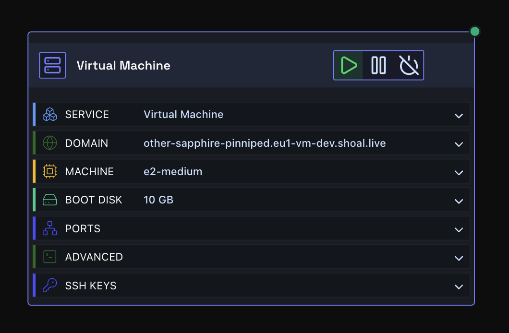
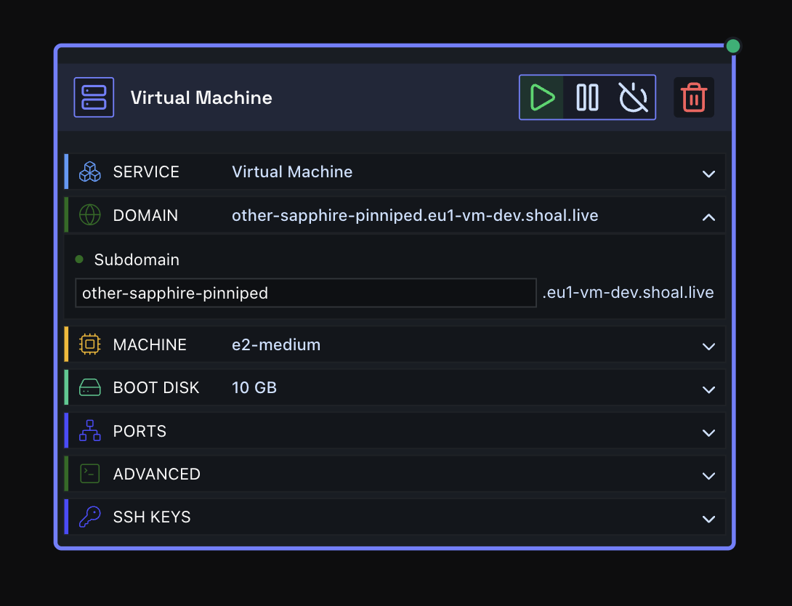
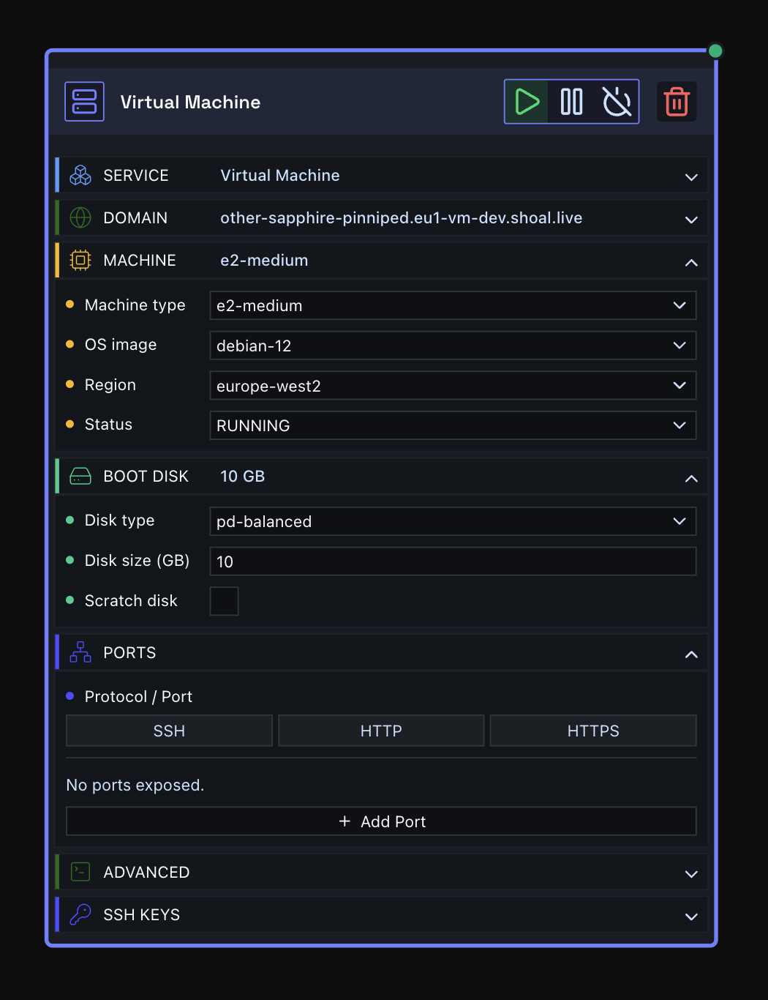
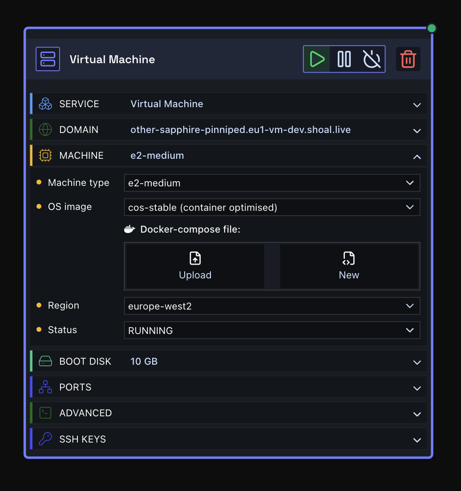
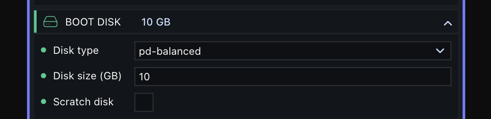
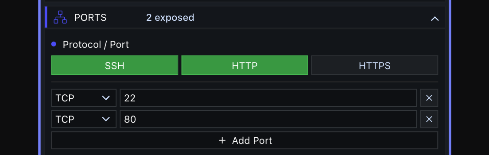
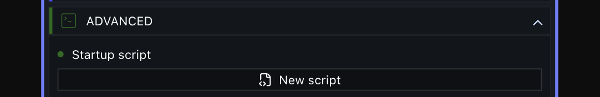
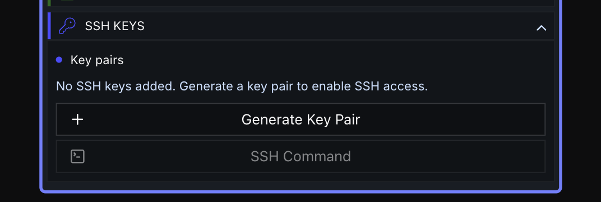
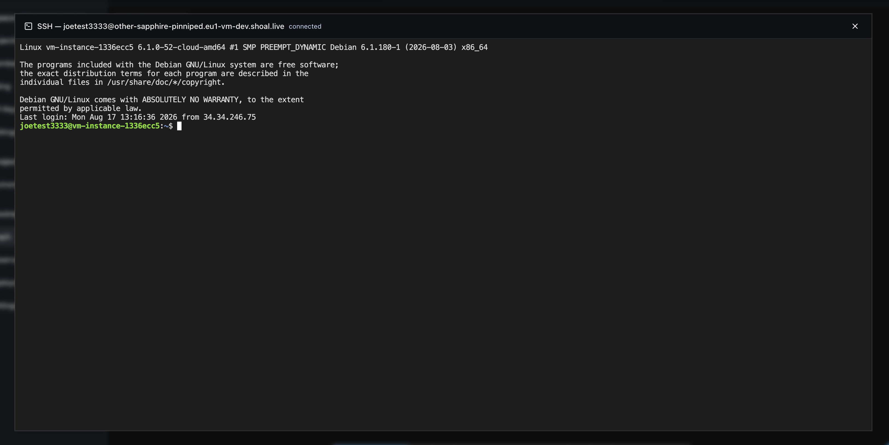

# Deploying a Virtual Machine

A **VM node** gives you a standalone virtual machine - a real GCE-backed VM you can SSH into, run a Docker Compose stack on, or boot a custom OS on. Unlike a container node, it doesn't need a gateway node to get a public address: every VM gets its own subdomain on `eu1-vm.shoal.live`.

Drag a VM node onto the canvas, configure it, and deploy.



### Step One: Domain

Expand the **Domain** section and enter a subdomain. This is where your VM will be reachable, e.g. `my-vm` becomes `my-vm.eu1-vm.shoal.live`.



### Step Two: Machine

Expand the **Machine** section and configure:

- **Machine type** - `e2-micro`, `e2-small`, `e2-medium`, `e2-standard-2`, `e2-standard-4`, `e2-standard-8` (vCPU/memory scale up the list).
- **OS image** - Debian 11/12, Ubuntu 22.04/24.04 LTS, or Container-Optimized OS (`cos-cloud`, stable/beta, amd64/arm64).
- **Region** - the GCP region the VM runs in.
- **Status** - `RUNNING`, `SUSPENDED`, or `TERMINATED`. This is the desired state Shoal reconciles the VM to.



!!! warning "Changing the OS image is destructive"
    Switching OS image after the VM has been created wipes the machine on next redeploy - it's a fresh boot disk, not an in-place upgrade.

#### Container-Optimized OS + Docker Compose

If you pick a `cos-cloud` image, a **Docker Compose** field appears. Paste (or upload) a `docker-compose.yml` and Shoal runs it on boot - no manual `docker compose up` needed.



### Step Three: Boot disk

- **Disk type** - `pd-standard`, `pd-balanced`, `pd-ssd`, `pd-extreme`, or the `hyperdisk-*` variants.
- **Disk size (GB)** - minimum 10 GB.
- **Scratch disk** - optional local SSD scratch disk.



### Step Four: Ports

Open the firewall for the protocols/ports your VM needs. Quick-add buttons cover SSH (22), HTTP (80), and HTTPS (443); add custom rows for anything else. Supported protocols: TCP, UDP, ICMP, ESP, AH, SCTP.



### Step Five: Advanced - startup script

Expand **Advanced** to write a startup script (a bash script, equivalent to a GCE `startup-script`) that runs once on boot.



### Step Six: SSH Keys

Expand **SSH Keys** and either generate a new keypair in-browser, add your own existing key pair, or reuse a key you've already saved in this browser. You can add multiple named keys to a single VM.



#### How keys are generated and stored

- New key pairs are generated **in your browser** (Ed25519, via the Web Crypto API). The private key is never sent to Shoal's servers - only the public key is saved, as an authorized key on the VM.
- When a new pair is generated, you get one chance to keep the private key: copy it, download it as a `.pem` file, or check **"Save to browser, encrypted with a passphrase."** If you close the dialog without doing one of these, the private key is gone for good - it cannot be regenerated or recovered, and the VM will still trust the (now-orphaned) public key.
- Checking "Save to browser" the first time prompts you to set a **vault passphrase**. This passphrase encrypts the private key (AES-GCM, PBKDF2-derived) before it's written to your browser's local storage. Shoal never sees the passphrase or the decrypted key.
- The passphrase is **per-browser**, not per-VM or per-key - one passphrase unlocks every saved key across every space, project, and environment in that browser. It only exists on the device you set it on; there's no server-side backup or cross-device sync, and no "forgot passphrase" recovery. Losing it means losing every key saved under it.

#### Deleting saved keys

- **A single saved key** - reopen the SSH Keys dialog, find it under "Saved keys," and click the ✕ next to it. This deletes only that private key from your browser's local vault; it does **not** remove the matching public key from any VM's authorized keys (do that from the node's SSH Keys list instead, via its own remove action).
- **Every key saved in a space** - go to the space's **Settings → SSH Keys**, and use **"Delete all SSH keys in this space."** This clears the vault entries scoped to that space *and* strips the matching public keys off every VM in it.
- **Reset your vault passphrase entirely** - same Settings page, **"Reset passphrase."** This wipes **every** saved key in that browser, across all spaces/projects/environments, not just the current one - use it if you've forgotten the passphrase. You'll be prompted to set a new one next time you save a key.

All three actions are irreversible.

### Step Seven: Deploy

Press **Deploy**. You can watch progress via the **Observability** menu.

### Connecting to your VM

Once deployed, there are two ways in:

- **In-browser terminal** - open the SSH command dialog on the node and connect straight from the browser. No local SSH client needed.
- **Your own SSH client:**

```
ssh -i ~/.ssh/<keyname> <user>@<subdomain>.eu1-vm.shoal.live
```



### Done

Your VM is live at `<subdomain>.eu1-vm.shoal.live`, reachable by SSH, and running whatever you configured - a bare OS, or a Docker Compose stack on Container-Optimized OS.

!!! note "Trial plan limits"
    On a trial plan, VM machine type is capped to `e2-micro`/`e2-small`, boot disk type to `pd-standard`, and boot disk size to 10 GB.
