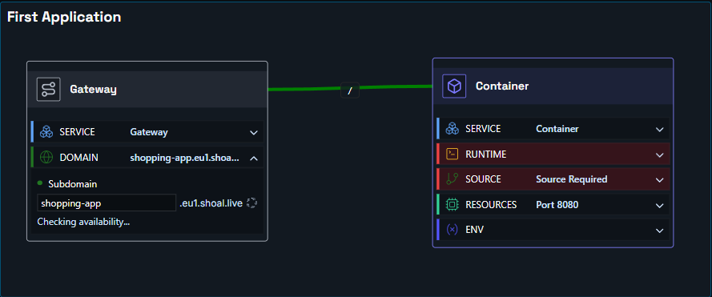
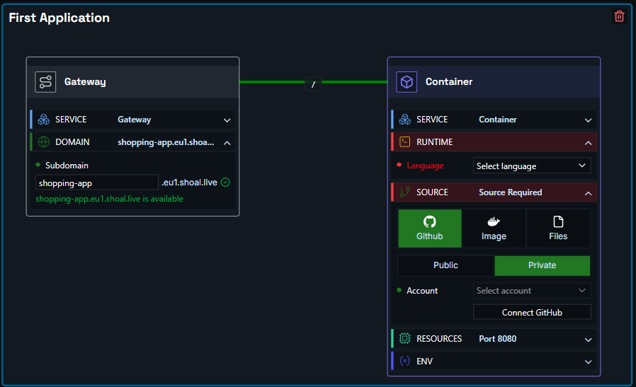

# Deploying an Application

Deploy in a few simple steps. In this example, we have an application we want to expose on the internet, with source code hosted on GitHub.

You need two components: a **container node** and a **gateway node**.

- **Container node** - links to your source code. Shoal builds and runs your container, scales it automatically, and keeps it resilient.
- **Gateway node** - where you set the DNS name (web address) you want your app to be reachable at.

Hit deploy, and it just works.

### Step One

Drag a container node and a gateway node onto the canvas, then link them together. You can also add a comment box if you like.

### Step Two

Click the gateway node to open it, expand the **Domain** section, and enter the URL name you want. For example, entering `shopping-test` will make your app available at `shopping-test.eu1.shoal.live`.

### Step Three

Click the container node to open it, expand the **Source** section, and set up your source - a GitHub repo, a container image, or a file upload. If your project includes a Dockerfile, Shoal builds from it; otherwise, for supported runtimes, Shoal auto-detects your stack and builds it for you.

### Step Four

Press **Deploy**. You can watch the deployment in real time via the **Deployments** page, or check build and runtime logs under **Observability & Logs**.

### Done

Your app is live at the address you configured - running in a scalable, resilient, and protected environment.
