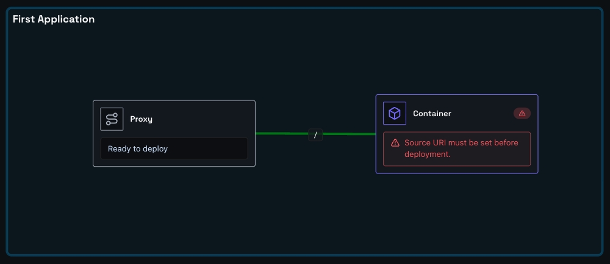

# Deploying an Application

Deploy in a few simple steps. In this example, we have an application we want to expose on the internet, with source code hosted on GitHub.

You need two components: a **container node** and a **proxy node**.

- **Container node** — links to your source code. Shoal builds and runs your container, scales it automatically, and keeps it resilient.
- **Proxy node** — where you set the DNS name (web address) you want your app to be reachable at.

Hit deploy, and it just works.

### Step One

Drag a container node and a proxy node onto the canvas, then link them together. You can also add a comment box if you like.

### Step Two

Click the proxy node, open the **Config** tab, and enter the URL name you want. For example, entering `shopping-test` will make your app available at `shopping-test.eu1.shoal.live`. You can also point a custom domain at this address.

### Step Three

Click the container node, open the **Config** tab, and set up your source — either a GitHub repo or a file upload. You'll need a Dockerfile in your code.

### Step Four

Press **Deploy**. You can watch the deployment in real time via the **Observability** menu, or by clicking the link on the deploy button.

### Done

Your app is live at the address you configured — running in a scalable, resilient, and protected environment.
