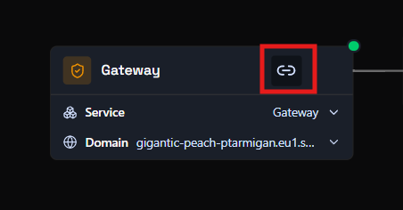
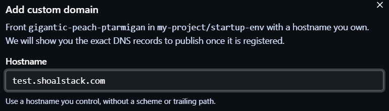
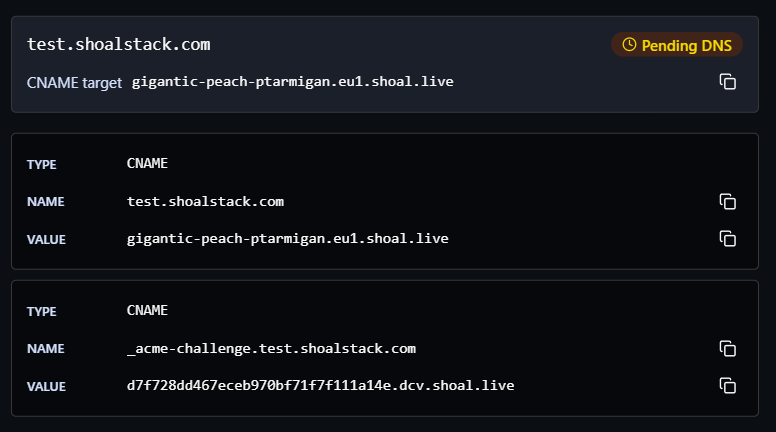
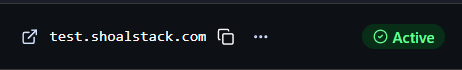

# How do I set up a custom domain?

Every gateway gets a default Shoal address like `gigantic-peach-ptarmigan.eu1.shoal.live`. You can put a hostname you own in front of it, such as `app.mycompany.com`, so users reach your deployment on your own domain.

Shoal handles SSL for custom domains. You don't need to set up a certificate.

## Before you start

- A deployment with a **gateway node**
- Access to the DNS settings for your domain (Cloudflare, Route 53, Namecheap, GoDaddy, etc.)

## 1. Open the gateway's custom domain settings

On your graph, find the **gateway node**. Its **Domain** row shows the default Shoal address. Click the **link icon** in the top-right corner of the node.



## 2. Enter your hostname

In the **Add custom domain** dialog, type the hostname you want to use, for example `test.shoalstack.com`.

- Use a hostname on a domain you control.
- Enter only the hostname: no `https://` and no trailing path.



Submit the dialog to register the hostname. Shoal then shows the DNS records you need to publish.

## 3. Add the DNS records at your DNS provider

The domain now appears with a **Pending DNS** status, along with two `CNAME` records. Use the copy buttons to copy each value exactly.



Add both records at your DNS provider:

| Type  | Name                               | Value                                      | Purpose                                      |
|-------|------------------------------------|--------------------------------------------|----------------------------------------------|
| CNAME | `test.shoalstack.com`              | `gigantic-peach-ptarmigan.eu1.shoal.live`  | Routes traffic for your hostname to the gateway |
| CNAME | `_acme-challenge.test.shoalstack.com` | `<token>.dcv.shoal.live`                | Lets Shoal verify the domain and issue its SSL certificate |

The values above are examples. Always copy the records shown for your own domain, because the `_acme-challenge` value is unique to each one.

!!! tip "Record names at your DNS provider"
    Many DNS providers add your root domain to the record name for you. If yours does, enter only the part before the root domain: `test` and `_acme-challenge.test` for the example above. If you enter the full name, some providers end up creating `test.shoalstack.com.shoalstack.com`.

!!! note "Using Cloudflare?"
    Set both records to **DNS only** (grey cloud), not proxied. With the proxy on, Shoal can't verify the domain or issue the certificate.

## 4. Wait for the domain to become active

DNS changes can take anywhere from a few minutes to a few hours to propagate. Once Shoal detects both records and issues the certificate, the status changes from **Pending DNS** to **Active**.



Your deployment is now reachable at `https://<your-hostname>`. Click the external link icon next to the hostname to open it.

## Troubleshooting

**The domain stays on Pending DNS.**
Check that both records exist and match the values shown in Shoal exactly. You can look up what DNS currently returns with:

```bash
nslookup -type=CNAME test.shoalstack.com
nslookup -type=CNAME _acme-challenge.test.shoalstack.com
```

If nothing comes back, the records haven't propagated yet or were created under the wrong name (see the tip in step 3).

**I already have an A record or another record for this hostname.**
A hostname can't have a `CNAME` alongside other records. Remove the existing record for that hostname before adding the `CNAME`.

**Can I use a root domain like `mycompany.com`?**
Most DNS providers don't allow a `CNAME` on the root domain. Use a subdomain such as `app.mycompany.com` or `www.mycompany.com`, or use your provider's `CNAME` flattening / `ALIAS` record if it offers one.
