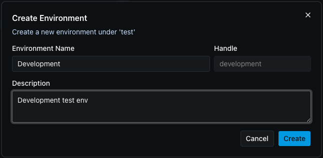
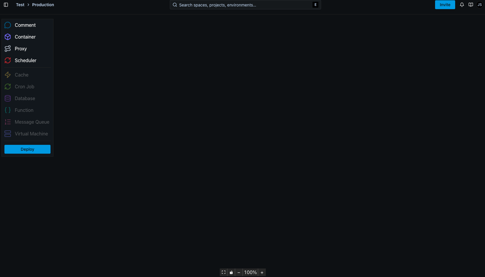

# Initial Setup

After logging in and selecting your project, you can create a new environment (if one does not exist) using the **Create** button.

Once your environment is ready, head to one of the deployment guides to get your app live.

Just select the environment from the list to login to see the canvas.

