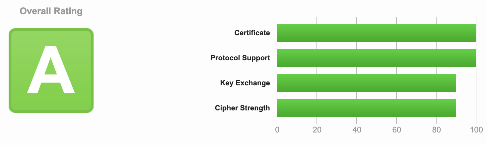

# Shoal Quick Start Guide

Welcome to Shoal - the simplest way to deploy your application to the internet. Point Shoal at your GitHub repo, connect a gateway, and hit deploy. Shoal handles containers, scaling, SSL, and routing automatically, so you can focus on building.

This guide walks you through everything you need to get started - from core concepts to deploying apps with databases, schedulers, and multi-service routing.

## Things you need to know

### What is a gateway? Why do I need one?
A gateway sits in front of your app and directs all incoming traffic to the right place. Think of it as a receptionist - visitors don't go straight to your desk, they check in first. On Shoal, your gateway handles this automatically so your app is reachable from the internet without any extra setup.

It also keeps your app secure and stable. The gateway shields your app from direct exposure to the internet, handles SSL so all traffic is encrypted, and protects against sudden spikes by rate limiting incoming requests - so a surge in traffic won't take your app down.

The Shoal gateway is configured to achieve an **A grade** on [SSL Labs](https://www.ssllabs.com/ssltest/){ target="_blank" } out of the box - no SSL configuration needed on your part.

{ .screenshot }

!!! info "What is SSL Labs?"
    [SSL Labs](https://www.ssllabs.com/ssltest/){ target="_blank" } is a free tool by Qualys that analyses the SSL/TLS configuration of any public-facing website and gives it a grade from A+ down to F. It checks things like which encryption protocols are enabled, certificate validity, and known vulnerabilities. An A grade means your site is using strong, modern encryption and is well protected in transit.

It also includes an **IPS (Intrusion Prevention System)**, which watches incoming traffic in real time and automatically blocks known attacks and malicious requests before they ever reach your app - so you get an extra layer of protection with no setup required.

### What is a container?
A container is a lightweight package that holds your app and everything it needs to run - code, dependencies, settings. It works the same way on any machine, so there are no "works on my computer" surprises. Shoal runs your app inside containers behind the scenes.

### What is a Dockerfile?
A Dockerfile is a simple text file that describes how to build your container. It lists the steps to set up your app - what base image to start from, what files to copy in, and what command to run. Think of it as a recipe: Shoal follows it to package your app into a container that's ready to deploy.

*You don't always need a Dockerfile - if your project doesn't include one, Shoal auto-detects your stack and builds it for you.*

### What is a function?
A function is a small piece of compute that runs on demand and scales to zero when idle, so you're not paying for a server that sits there waiting. It's a good fit for event-driven tasks and lightweight workloads - a webhook handler, an image resize, a one-off API endpoint. Point Shoal at your source and a gateway, same as a container, and it's live.

*See [Deploying a Function](deploy-app-function.md) for a full walkthrough.*

### What is a database node?
A database node provisions and manages a database for you and hands your app the connection details automatically - no connection strings to copy around by hand. Shoal currently supports two managed options: **Neon** (serverless Postgres that scales to zero) and **MongoDB Atlas** (managed MongoDB). Connect one to a container or function and its outputs map straight into your app's environment variables.

*See [Deploying with Neon](deploy-app-neon.md) and [Deploying with MongoDB](deploy-app-mongodb.md).*

### What about multiple services, or routing by path?
Bigger apps are often more than one service - an API, a worker, an admin panel - all living behind one domain. Connect several container or function nodes to the same gateway, and the gateway routes each request to the right one based on the URL path. You can also **rewrite** paths in transit, so a public path like `/accounts` can map to a completely different path on the service behind it.

*See [Deploying with Multiple Containers](deploy-app-multi.md) and [Path-Based Routing](path-routing.md).*

### What is a scheduler?
A scheduler runs tasks on a timer - like a cron job or a recurring reminder. If you need something to happen every night at midnight or every 5 minutes, a scheduler handles that for you without leaving a server running 24/7.

### Where does Shoal deploy?
Shoal currently deploys into **Google Cloud Platform (GCP)**. Support for Azure, AWS, and other cloud providers is coming soon - and if you want full control, you'll be able to deploy into your own private infrastructure too.

### What's a project, and an environment?
A **project** is a collection of services that belong together - your app, its database, maybe a background worker. An **environment** is a version of that project for a specific purpose: typically `development` (for testing changes) and `production` (the live version your users see). Changes in development don't affect production until you're ready.

### What do I get when I create a new environment?
Every new environment starts pre-wired with a starter app - a **gateway** already connected to a **container** - so there's something to deploy the moment you land on the canvas. If you uploaded source when creating it, that's pre-loaded onto the container (named "Welcome App") and you can hit **Deploy** straight away. If not, the container's there waiting for you to add your own source. It's just a starting point - delete or replace it any time.

