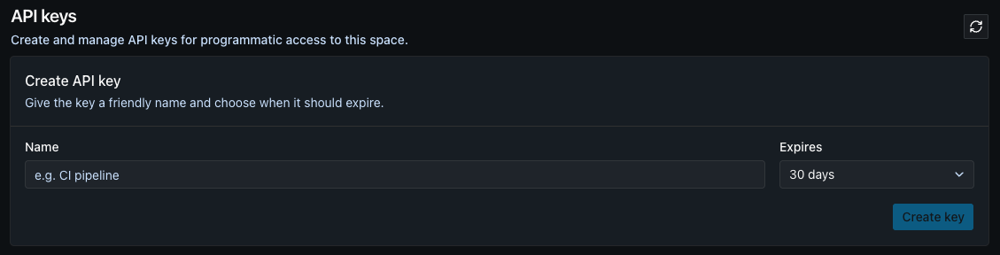
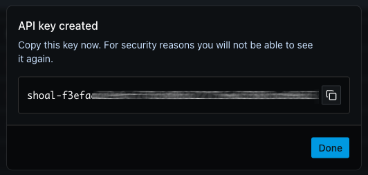

# Connect Your AI Assistant (MCP)

Shoal runs a **Model Context Protocol (MCP)** server, so you can drive your Shoal platform straight from the AI assistant or editor you already use. Once connected, your assistant can browse blueprints, create projects and environments, set environment variables, and inspect your deployment graph - all as you, using a key you control.

Any MCP-capable client works. This guide shows the eight most common ones. The setup is always the same three steps: **create an API key**, point your client at the **server URL**, and pass the key in the **`X-Api-Key`** header.

## 1. Create an API key

Your assistant authenticates to Shoal with an API key scoped to one of your spaces.

1. Go to **API keys** for your space at `app.shoalstack.com/spaces/<space>/api-keys`, where `<space>` is your space handle (the slug you see in the URL, e.g. `my-team`).

    

2. Click **Create key**, give it a **Name** you'll recognise (e.g. `Claude Desktop`), and choose when it should **Expire** - `30`, `60`, `90` days, `1 year`, or `Never`. The default is 30 days.

3. Click **Create key**. Your key is shown **once** - copy it now.

    

    !!! warning "You only see the key once"
        For security, Shoal shows the plaintext key a single time and never again. Copy it straight away and store it somewhere safe. Lost it? Just revoke the old one and create a new key.

!!! tip "Revoking a key"
    To turn off access, click the red **Revoke** button on the key's row. Revocation takes effect immediately - any assistant using that key stops working at once. Create a fresh key to reconnect.

## 2. Your MCP server details

You'll need these three values for every client below:

!!! info "Server details"
    | Field | Value |
    |---|---|
    | **URL** | `https://api.shoalstack.com/shoal-chatbot-service/mcp` |
    | **Transport** | Streamable HTTP |
    | **Auth header** | `X-Api-Key: <your-api-key>` |

## 3. Add it to your assistant

Pick your client. In every snippet, replace `YOUR_API_KEY` with the key you created in step 1.

=== ":simple-anthropic: Claude"

    **Claude Code** (CLI) - add the server in one command:

    ```bash
    claude mcp add --transport http shoal-mcp-server https://api.shoalstack.com/shoal-chatbot-service/mcp --header "X-Api-Key: YOUR_API_KEY"
    ```

    **Claude Desktop** - open **Settings → Connectors → Add custom connector**, paste the URL above, and add a custom header `X-Api-Key` with your key.

    More detail: [Claude MCP docs](https://docs.claude.com/en/docs/claude-code/mcp){ target="_blank" }.

=== ":simple-googlegemini: Gemini"

    **Gemini CLI** - add the server to `~/.gemini/settings.json`:

    ```json
    {
      "mcpServers": {
        "shoal-mcp-server": {
          "httpUrl": "https://api.shoalstack.com/shoal-chatbot-service/mcp",
          "headers": { "X-Api-Key": "YOUR_API_KEY" }
        }
      }
    }
    ```

    More detail: [Gemini CLI MCP docs](https://google-gemini.github.io/gemini-cli/docs/tools/mcp-server.html){ target="_blank" }.

=== ":fontawesome-brands-openai: ChatGPT (OpenAI)"

    In ChatGPT, open **Settings → Connectors → Create** (or **Add custom connector**), then:

    1. Paste the URL `https://api.shoalstack.com/shoal-chatbot-service/mcp`.
    2. Add a custom header `X-Api-Key` set to your key.

    !!! info "Custom connectors need the right plan"
        Adding your own remote MCP server requires a ChatGPT plan with custom connectors / developer mode enabled (Plus, Pro, Business, or Enterprise). The exact menu wording changes as ChatGPT evolves - see [OpenAI's connector docs](https://platform.openai.com/docs/mcp){ target="_blank" }.

=== ":simple-x: Grok (xAI)"

    Grok can call remote MCP servers.

    - **Grok app** - open **Settings → Connectors → Add MCP server** (or **Add custom connector**), paste the URL `https://api.shoalstack.com/shoal-chatbot-service/mcp`, and add a custom header `X-Api-Key` with your key.
    - **Grok CLI / MCP-capable Grok client** - point it at the same URL with an `X-Api-Key` header, using the client's `mcpServers` config (same shape as the Cursor tab).

    !!! info "xAI MCP support is newer"
        Grok's MCP connector support is relatively new and the exact menu wording changes as xAI iterates. If you don't see an MCP / custom-connector option, check [xAI's documentation](https://docs.x.ai){ target="_blank" } for the current steps.

=== ":simple-cursor: Cursor"

    Create `.cursor/mcp.json` in your project (or `~/.cursor/mcp.json` for all projects):

    ```json
    {
      "mcpServers": {
        "shoal-mcp-server": {
          "url": "https://api.shoalstack.com/shoal-chatbot-service/mcp",
          "headers": { "X-Api-Key": "YOUR_API_KEY" }
        }
      }
    }
    ```

    Then enable the server under **Settings → MCP**. More detail: [Cursor MCP docs](https://docs.cursor.com/context/model-context-protocol){ target="_blank" }.

=== ":simple-windsurf: Windsurf"

    Open **Windsurf Settings → Cascade → MCP Servers → Manage → View raw config**, and add the server to `~/.codeium/windsurf/mcp_config.json`:

    ```json
    {
      "mcpServers": {
        "shoal-mcp-server": {
          "serverUrl": "https://api.shoalstack.com/shoal-chatbot-service/mcp",
          "headers": { "X-Api-Key": "YOUR_API_KEY" }
        }
      }
    }
    ```

    Then click **Refresh**. More detail: [Windsurf MCP docs](https://docs.windsurf.com/windsurf/cascade/mcp){ target="_blank" }.

=== ":material-robot: Cline"

    In the Cline panel, open the **MCP Servers** icon → **Configure MCP Servers**, then add to `cline_mcp_settings.json`:

    ```json
    {
      "mcpServers": {
        "shoal-mcp-server": {
          "type": "streamableHttp",
          "url": "https://api.shoalstack.com/shoal-chatbot-service/mcp",
          "headers": { "X-Api-Key": "YOUR_API_KEY" }
        }
      }
    }
    ```

    More detail: [Cline MCP docs](https://docs.cline.bot/mcp/configuring-mcp-servers){ target="_blank" }.

=== ":material-microsoft-visual-studio-code: VS Code"

    With GitHub Copilot, create `.vscode/mcp.json` in your workspace:

    ```json
    {
      "servers": {
        "shoal-mcp-server": {
          "type": "http",
          "url": "https://api.shoalstack.com/shoal-chatbot-service/mcp",
          "headers": { "X-Api-Key": "${input:shoal-api-key}" }
        }
      },
      "inputs": [
        {
          "id": "shoal-api-key",
          "type": "promptString",
          "description": "Shoal API key",
          "password": true
        }
      ]
    }
    ```

    Using `${input:...}` keeps your key out of the committed file - VS Code prompts for it once. More detail: [VS Code MCP docs](https://code.visualstudio.com/docs/copilot/chat/mcp-servers){ target="_blank" }.

## Verify it works

Ask your assistant to **list your Shoal blueprints**. Behind the scenes that calls the read-only `list_blueprints` tool - if you get a list back, you're connected and ready to go. From there you can ask it to create a project, add an environment, set variables, and more.

!!! tip "Not connecting?"
    - Check the key hasn't been revoked or expired under **Space → API keys**.
    - Confirm the header name is exactly `X-Api-Key`.
    - Make sure you copied the whole key with no extra spaces.
    - Restart the client after editing its config file so it reloads the server.

New to Shoal? Start with the [Initial Setup guide](first-setup.md) to create your first space and project.
