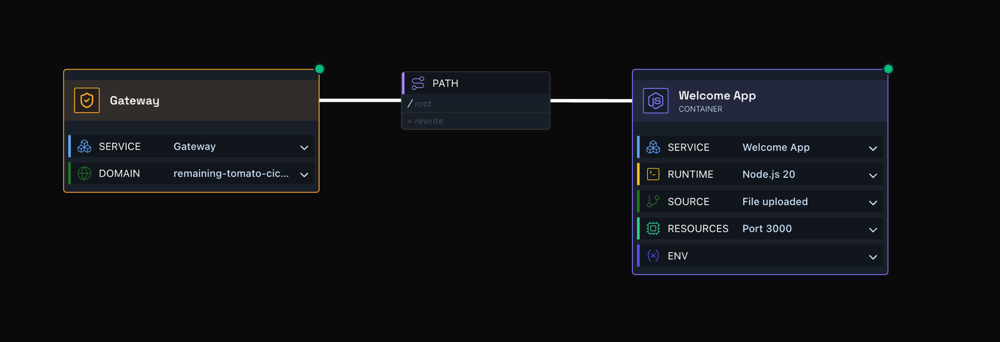
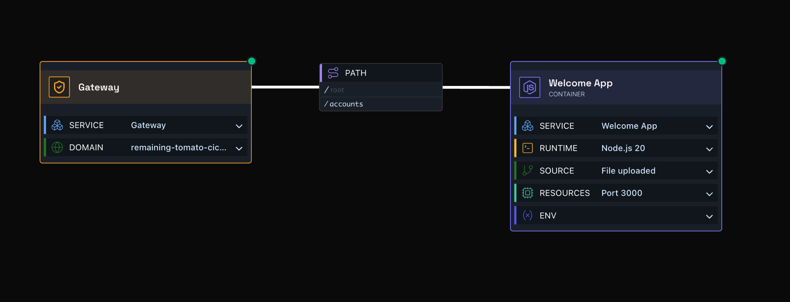
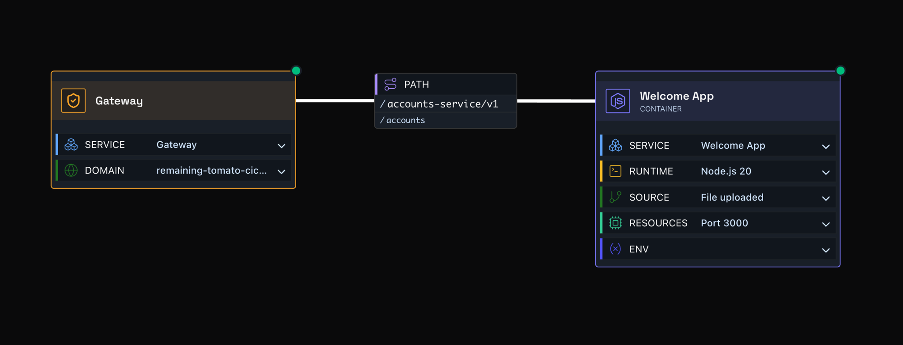

# Path-Based Routing

By default a gateway forwards requests straight through to whatever path they came in on. **Path routing** lets you decouple the path your users hit on the gateway from the path your service actually listens on - so you can point multiple paths at one service, or expose a service that lives deep under its own path prefix, without changing your app's code.

You configure this on the connector between the **gateway node** and the **container node**: a **Path** field, and an optional **Rewrite** field.

## Default: no rewrite

In the simplest case, the service listens on `/`. Hit the gateway, and the request routes straight through to `/` on the service - no rewriting involved.

## Rewriting to a fixed path

You can also rewrite the incoming path. Leave **Path** as `/`, but set **Rewrite** to `/accounts`, and every request to `/accounts` on the gateway is routed to `/` on the service.

*Requests to `https://<gateway>/accounts` on the gateway are routed to `/` on the service.*

## Rewriting into a nested service path

Take this further if your service exposes its own base path - for example `/accounts-service/v1/` - and you want all `/accounts` traffic to land there. Set **Path** to `/accounts-service/v1/` and **Rewrite** to `/accounts`.

Now any gateway request under `/accounts` gets its `/accounts` prefix swapped for `/accounts-service/v1/`, with the rest of the URL preserved. So `/accounts/balance` on the gateway actually routes to `/accounts-service/v1/balance` on the service.

*`https://<gateway>/accounts/balance` routes to `/accounts-service/v1/balance` on the service.*
